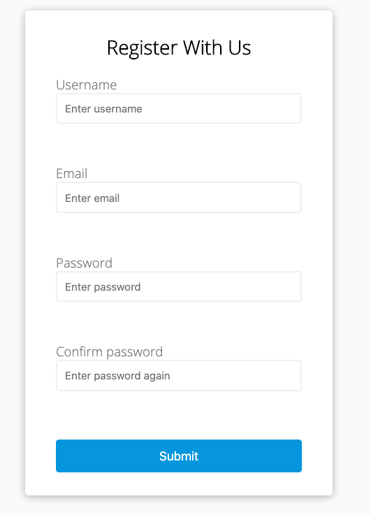
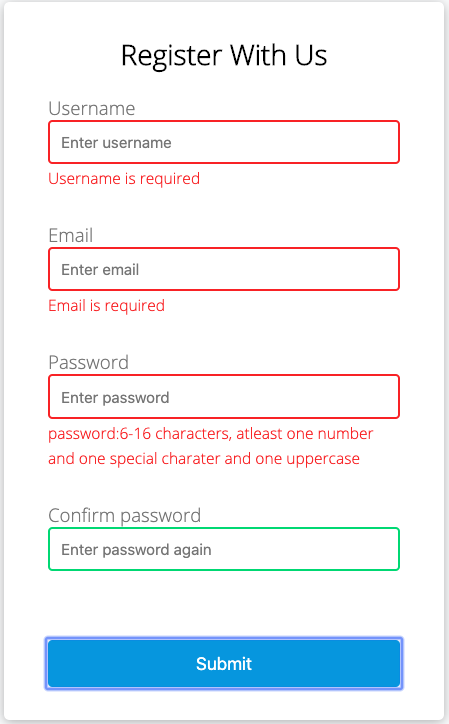
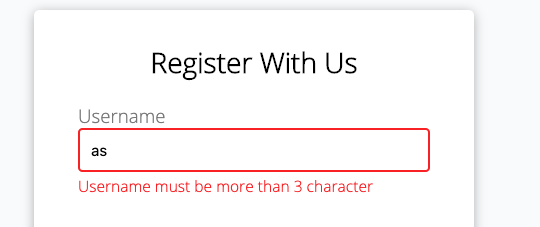
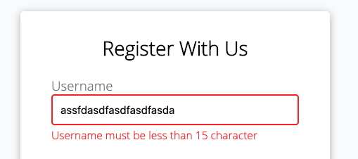
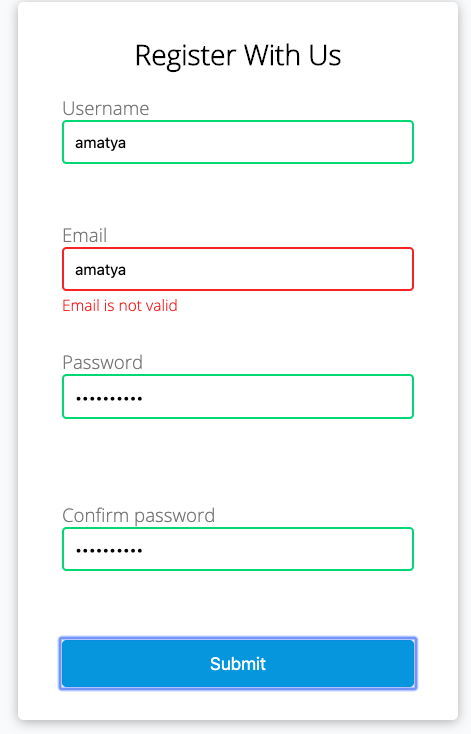
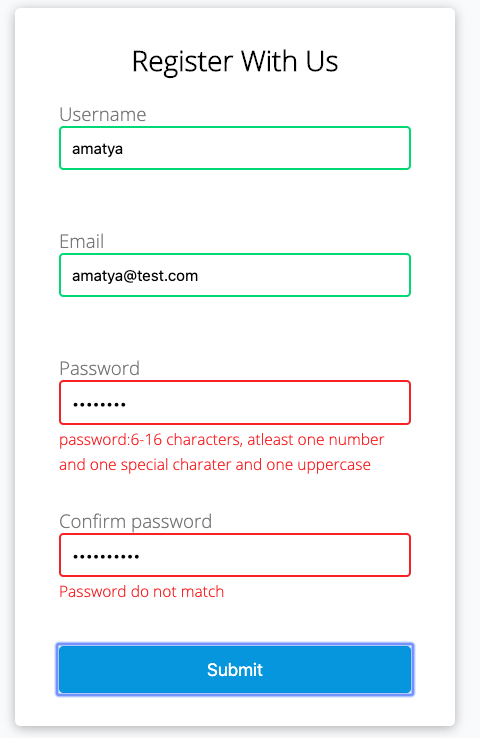
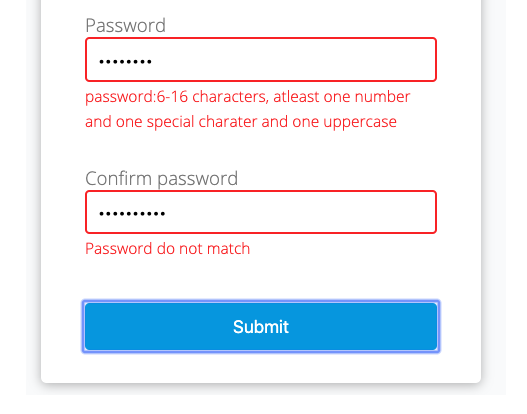
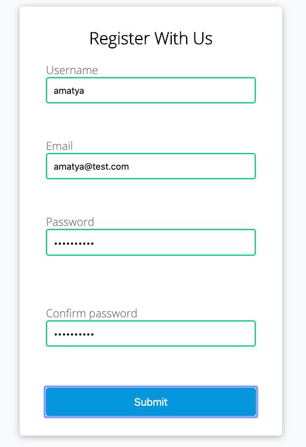

# Project: Form Validator

Github Page : https://niraj-amatya.github.io/Form-Validation/

Github: https://github.com/Niraj-Amatya

### Project Introduction

This is a simple client side form validation. It checks if the fields are filled, username and passwords meets the length specification and password passes the validation and email is valid.

**Note:** There are two Javascript file script.js and script1.js. script1.js is not a dry code and uses same code repeatedly. So script.js is used with actual UI. Script1.js is just for my understanding and more simplicity of the code. This shows how the final project was developed.

#### **Technology Used:**

HTML 5, CSS and vanilla Javascript. No framework or libraries used.

**Inpiration:** Brad Traversy "20 Web Projects with Vanilla Javascript"

### Project Specification

- Create from UI
- Show error messages under specific units
- Check if all the fileds are filled and give specific error message
- Check length of username
- Email validation
- Check password validation and give error message if validation does not meet
- Check if password matches to confirm password

---

#### Create from UI

Used HTML and CSS

#### Check if all the fileds are filled and give specific error message under specific units

#### Check length of username:

Check if the length is not less then the minimum character required.

Check if the length is not more then the maximum character required.

#### Email validation:

Email validation using regular expression.

#### Check password validation and give error message if validation does not meet

Validation was checked using regular expression

#### Check if password matches to confirm password

#### Success

When all the fields meet the necessary requirements, you see green color in the border of the box.

